# Customer Churn Prediction and AI Recommendation Agent

## Overview

This project focuses on predicting customer churn in a telecommunications company and building an AI-powered decision support agent capable of generating actionable retention strategies.

The system combines:

- Machine learning for churn prediction
- SHAP explainability for identifying churn drivers
- Counterfactual simulations for what-if analysis
- A LangChain agent orchestrating predictions, explanations, simulations, and business recommendations

The objective is to move beyond static prediction and provide interpretable, business-oriented retention insights.

---

## Live Demo

🚀 Streamlit Application:

https://churnproject-iwgy6xubghtjanepybgzce.streamlit.app/

---

## System Architecture

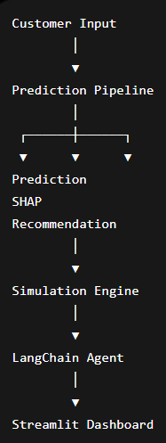

---
# Application Screenshots

## Title

---

## Features

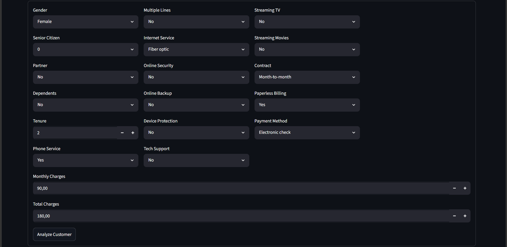

---

## Churn Analysis Dashboard

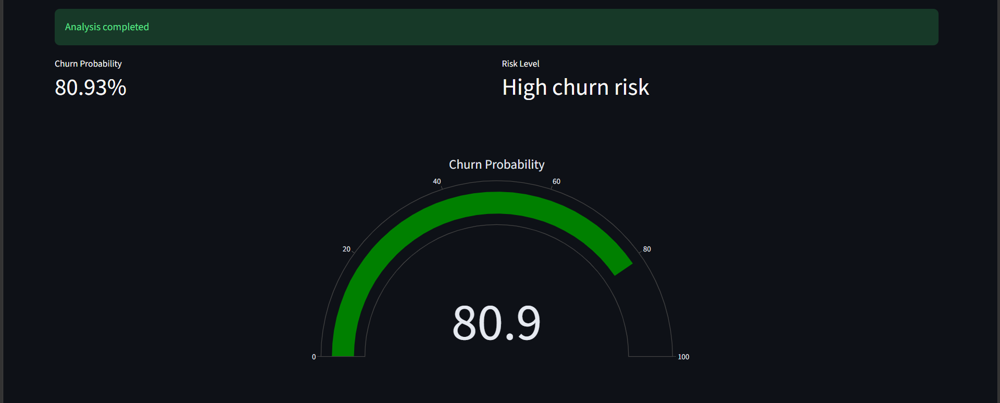

---

## SHAP Explainability

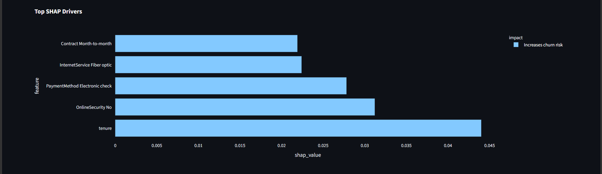

---

## Recommendations

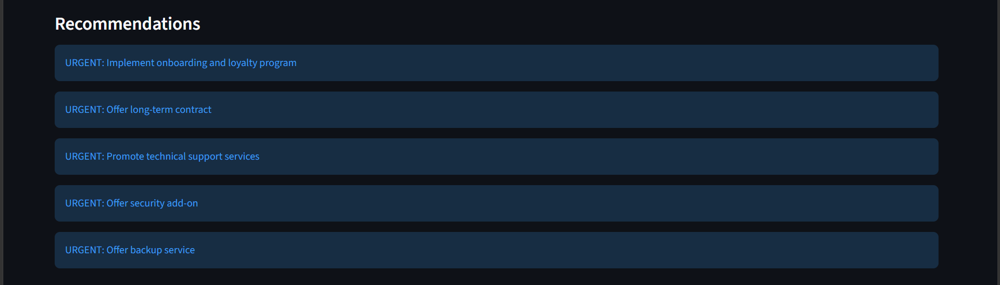

---

## Customer Profile Input

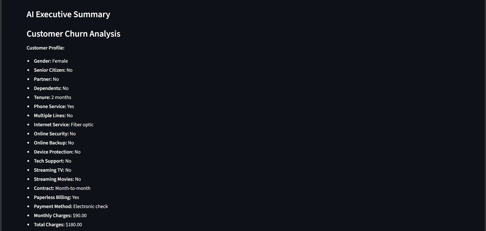

---

## SHAP Explainability and recommendations

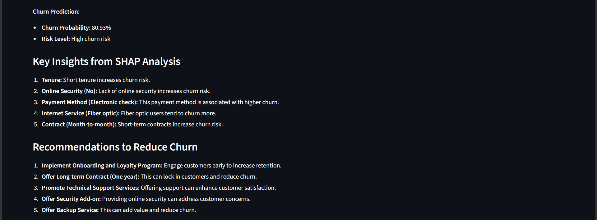

---

## Counterfactual Simulations

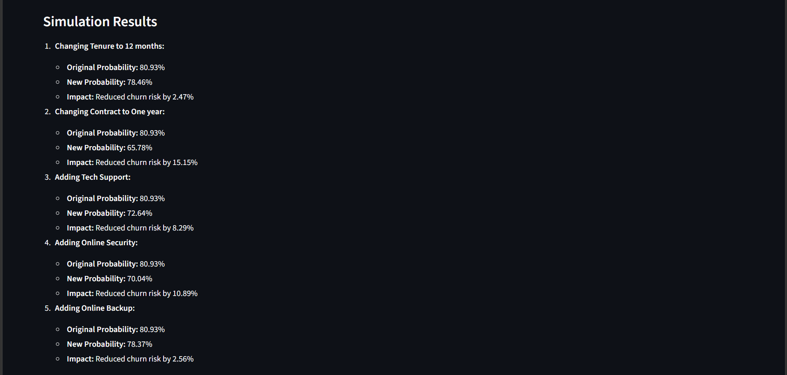

---

## prioritized actions and conclusion

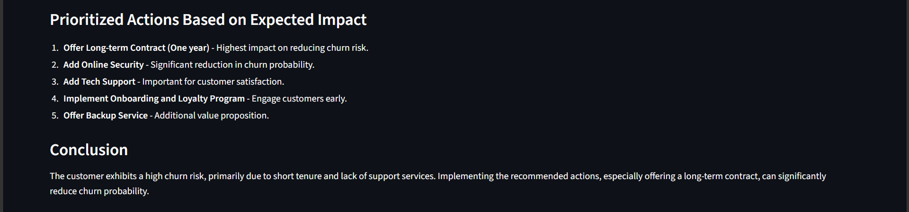

---

## Objectives

The project aims to:

- Predict customer churn probability
- Explain the main drivers behind each prediction
- Simulate the impact of business actions on churn risk
- Generate prioritized retention recommendations
- Build an AI agent capable of reasoning over customer profiles

---

## Dataset

The project uses the Telco Customer Churn dataset.

The dataset contains:

### Customer Demographics

- Gender
- SeniorCitizen
- Partner
- Dependents

### Account Information

- Tenure
- Contract type
- Payment method
- Paperless billing

### Subscribed Services

- Internet service
- Online security
- Online backup
- Device protection
- Technical support
- Streaming services

### Billing Information

- Monthly charges
- Total charges

### Target Variable

- Churn

---

## Project Architecture

The system is composed of four main layers:

### 1. Predictive Machine Learning Model

A supervised classification model predicts churn probability.

### 2. Explainability Layer

SHAP values are used to explain the main drivers behind churn predictions.

### 3. Simulation Engine

Counterfactual simulations estimate how changes in customer features impact churn probability.

### 4. AI Agent Layer

A LangChain agent orchestrates:

- churn prediction
- SHAP explanation
- business recommendations
- scenario simulations

---

## Data Preparation

The preprocessing pipeline includes:

### Data Cleaning

- Converted `TotalCharges` to numeric
- Removed missing values

### Feature Engineering

- Separation of numerical and categorical variables
- One-hot encoding for categorical features
- Standard scaling for numerical features

### Train/Test Split

- Stratified train-test split

### Preprocessing Pipeline

A `ColumnTransformer` pipeline was used to ensure consistent preprocessing during both training and inference.

---

## Modeling

Several machine learning models were evaluated:

- Logistic Regression
- Random Forest
- Gradient Boosting
- AdaBoost
- XGBoost
- Decision Tree

The project includes:

- Baseline model comparison
- Hyperparameter tuning using `GridSearchCV`
- Experiment tracking with MLflow
- Automatic best model selection based on recall score

The final selected model is dynamically determined during training
based on evaluation metrics and hyperparameter optimization results.

The training pipeline automatically selects the best-performing model
according to the target business metric (recall).

### Model selection

The selected model was obtained after hyperparameter optimization using `GridSearchCV`.

### Reasons for Selection

- Highest recall score among all evaluated models
- Better identification of customers likely to churn
- Improved performance after hyperparameter tuning
- Strong overall classification performance
- Suitable for business-oriented churn prevention use cases

---

## Experiment Tracking with MLflow

MLflow was integrated into the training pipeline to track:

- Model parameters
- Hyperparameters
- Evaluation metrics
- Training runs
- Serialized model artifacts

This enables:

- Reproducibility
- Model comparison
- Experiment management
- Better monitoring of tuning results

Tracked experiments include:

- Baseline model evaluation
- Tuned model evaluation using `GridSearchCV`

---

## Model Evaluation

The evaluation focused primarily on identifying churners correctly.

### Main Metrics

- Recall
- Precision
- F1-score
- ROC-AUC

The model prioritizes recall to reduce false negatives and better identify customers at risk of leaving.

---

## Hyperparameter Optimization

Hyperparameter tuning was performed using `GridSearchCV` on selected models:

- Logistic Regression
- Random Forest
- XGBoost

The optimization objective was:

### Recall Score

This choice reflects the business objective of minimizing missed churners.

The final selected model may vary depending on:
- Hyperparameter optimization
- Cross-validation results
- Data split variations
- Model generalization performance

The pipeline automatically saves the best-performing model
based on recall optimization.

---

## SHAP Explainability

SHAP (SHapley Additive exPlanations) was integrated to explain individual churn predictions.

The explainability layer identifies:

- which features increase churn risk
- which features reduce churn risk
- the relative importance of each feature for a specific customer

### Example Churn Drivers

- Month-to-month contract
- Low tenure
- High monthly charges
- Lack of technical support

This allows the system to generate more reliable and interpretable recommendations.

---

## Counterfactual Simulations

The simulation engine performs what-if analysis by modifying customer attributes and recomputing churn probability.

### Examples

- Switching from month-to-month to one-year contract
- Adding technical support
- Reducing monthly charges

This enables quantitative evaluation of retention strategies.

### Example Result

- Churn probability reduced from 66.9% to 47% after changing contract type to one year.

---

## AI Agent Design

The project includes a LangChain-based AI agent capable of orchestrating multiple tools.

### Agent Responsibilities

- Predict churn probability
- Explain churn drivers using SHAP
- Generate business recommendations
- Simulate retention actions
- Rank actions by expected impact

### Tools Used

- full_customer_analysis
- simulate_change

### Agent Workflow

The agent follows the workflow:

1. Run a complete customer analysis through the prediction pipeline
2. Retrieve churn prediction, SHAP explanations, and recommendations
3. Identify important churn drivers
4. Simulate candidate retention actions
5. Evaluate the impact of each action
6. Generate an executive business summary

---

## Recommendation Logic

The recommendation engine combines:

- model predictions
- SHAP explanations
- business rules
- simulation results

### Typical Recommendations

- Offer long-term contracts
- Improve onboarding experience
- Promote technical support services
- Offer bundled services
- Improve customer engagement

### Risk Prioritization

| Churn Probability | Risk Level |
|---|---|
| > 0.70 | High Risk |
| 0.40 – 0.70 | Medium Risk |
| < 0.40 | Low Risk |

---

## Streamlit Application

A Streamlit application was developed to provide an interactive user interface for customer churn analysis.

### Features

The application allows users to:

- Enter customer profile information
- Predict churn probability
- Visualize churn risk through KPI indicators
- Display SHAP-based feature importance
- Generate retention recommendations
- Obtain an AI-generated executive summary
- Validate recommendations through counterfactual simulations

### Visual Components

- Churn probability KPI
- Risk level KPI
- Churn probability gauge chart
- SHAP feature importance visualization
- Recommendation cards
- AI-generated business summary

The interface provides a business-friendly view of model predictions and recommended retention actions.

---

## FastAPI Backend

A production-ready FastAPI backend was developed to expose the churn prediction system through REST APIs.

### Available Endpoints

#### POST /pipeline

Runs the complete prediction pipeline and returns:

- churn prediction
- SHAP explanations
- recommendations

#### POST /analyze

Runs the LangChain agent and returns:

- business summary
- simulation results
- prioritized retention actions

### Interactive Documentation

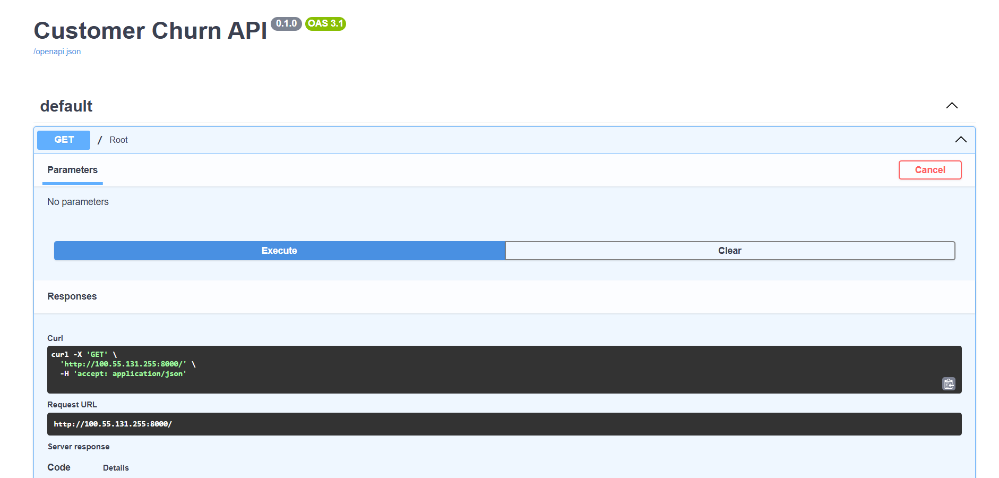
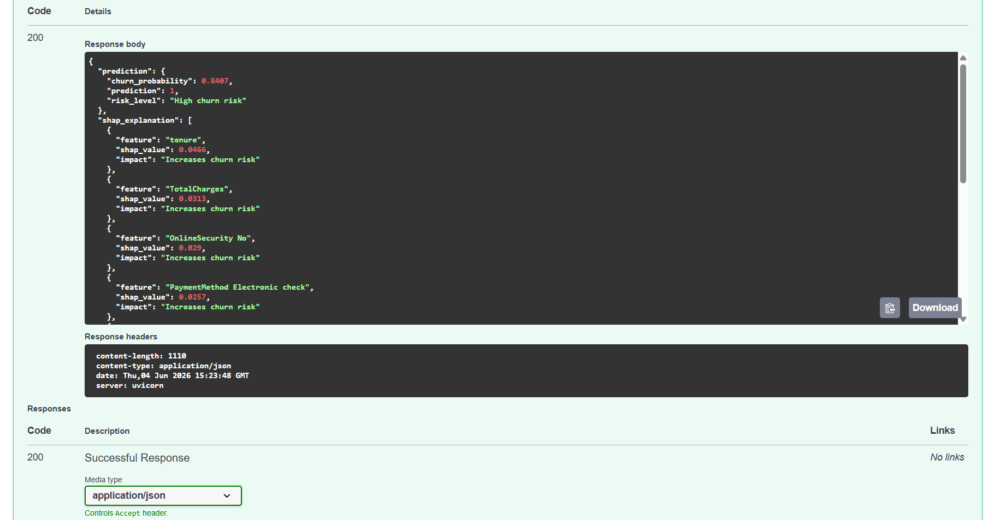
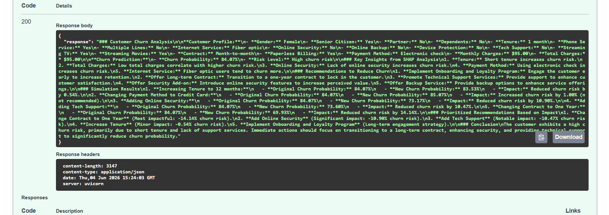

FastAPI automatically generates Swagger documentation available at:

http://localhost:8000/docs

---

## Docker Deployment

The FastAPI backend was containerized using Docker.

### Benefits

- Reproducible deployment
- Environment consistency
- Easier cloud deployment
- Simplified CI/CD integration

### Build

docker build -t churn-api .

### Run

docker run -p 8000:8000 churn-api

---

## CI/CD Pipeline

A complete CI/CD pipeline was implemented using GitHub Actions and AWS services.

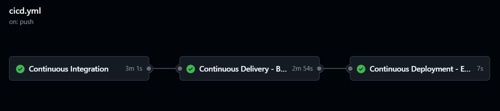

### Continuous Integration

Every push to the main branch automatically triggers:

- Dependency installation
- Automated API testing with Pytest
- Docker image build validation

### Continuous Delivery

The pipeline automatically:

- Builds the Docker image
- Pushes the image to Amazon ECR

### Continuous Deployment

The deployment pipeline automatically:

- Triggers a new ECS deployment
- Pulls the latest image from ECR
- Launches a new Fargate task
- Replaces the previous running version

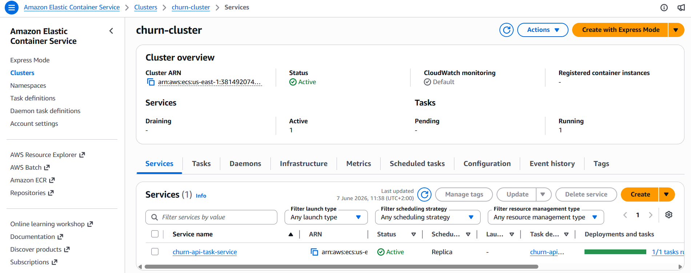

### CI/CD Workflow

GitHub
|
GitHub Actions
|
Pytest
|
Docker Build
|
Amazon ECR
|
Amazon ECS Fargate
|
Production API

---

# Monitoring & Observability

The project includes infrastructure and machine learning monitoring capabilities.

### AWS CloudWatch

CloudWatch is used to monitor the deployed ECS Fargate service.

Tracked metrics include:

- CPU Utilization
- Memory Utilization
- Running Tasks Count

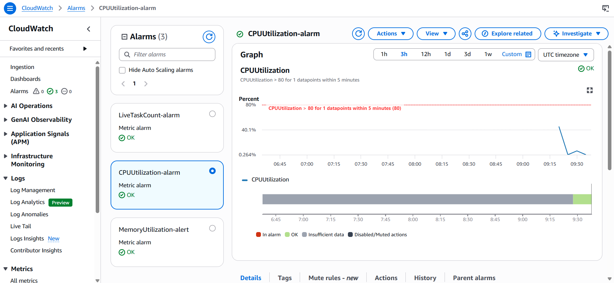

### SNS Email Alerts

CloudWatch alarms are connected to Amazon SNS notifications.

Email alerts are automatically sent when:

- CPU utilization exceeds the defined threshold
- Memory utilization exceeds the defined threshold
- The number of running ECS tasks falls below the expected value

### ML Monitoring

Prediction requests are automatically logged into a production dataset.

Each prediction stores:

- Customer features
- Churn probability
- Predicted class
- Risk level
- Timestamp

### Data Drift Detection

Evidently AI is used to compare production data with the original training dataset.

The generated drift report provides:

- Feature distribution comparison
- Drift detection statistics
- Dataset drift summary
- Per-feature drift analysis

This allows continuous monitoring of data quality and model reliability after deployment.

---

## ML Monitoring

The project includes data drift monitoring using Evidently AI.

Production predictions are logged and compared against the training dataset.

Features with significant distribution changes are automatically detected.

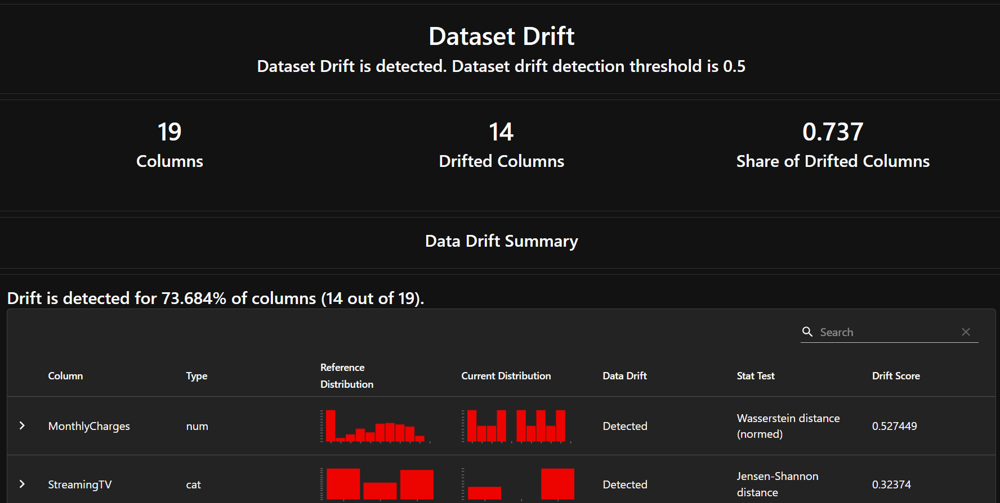

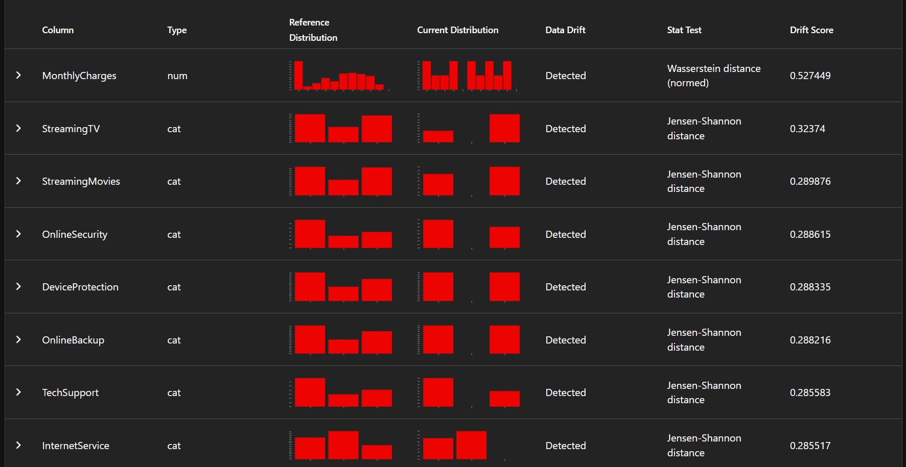

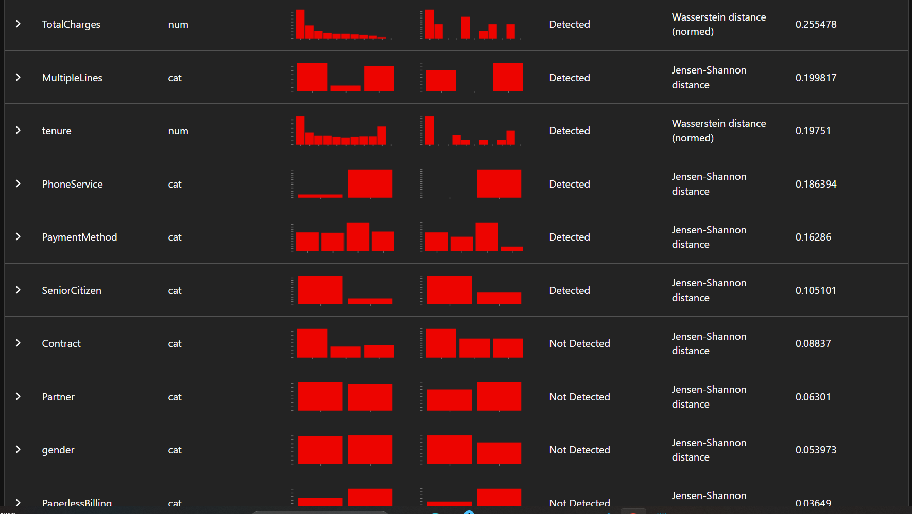

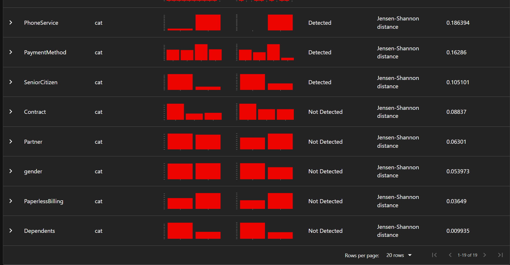

---

## Future Improvements

- Store prediction logs in Amazon S3
- Automate Evidently report generation
- Integrate Grafana dashboards
- Add model retraining pipeline
- Implement prediction drift monitoring

---

## Example End-to-End Workflow

The system performs the following steps:

1. Customer profile submission
2. Churn probability prediction
3. SHAP explanation generation
4. Recommendation generation
5. Counterfactual simulation
6. AI executive summary creation

Example output:

- Churn Probability: 41.3%
- Risk Level: Medium Risk
- Main Driver: Electronic Check payment method
- Best Action: Switch to a one-year contract
- Expected Reduction in Churn Probability: 5.05%

---

## Technologies Used

### Machine Learning

- Scikit-learn
- XGBoost

### Explainability

- SHAP

### AI Agent Framework

- OpenAI GPT-4o-mini
- LangChain

### Data Processing

- Pandas
- NumPy

### Visualization

- Matplotlib
- Seaborn

### Application

- Streamlit
- Plotly

### Backend

- FastAPI
- Uvicorn

### Containerization

- Docker

### Cloud & DevOps

- Docker
- GitHub Actions
- Amazon ECR
- Amazon ECS Fargate
- AWS IAM
- AWS VPC
- Pytest

---

## Conclusion

This project combines machine learning, explainable AI, counterfactual simulations, and LLM-based reasoning to create an intelligent customer retention decision-support system.

Rather than only predicting churn, the system helps identify why customers are likely to leave and which actions are most effective for reducing churn risk.